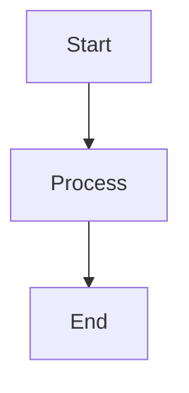
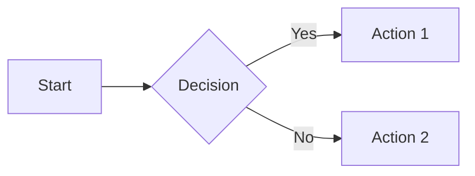
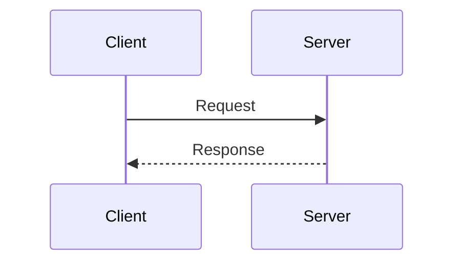
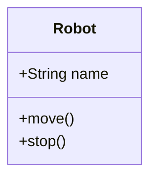
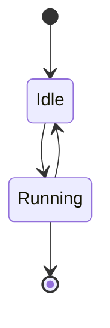

# Contributing to Physical AI & Humanoid Robotics Course

Thank you for your interest in contributing to this project! This document provides guidelines for contributing to the documentation and codebase.

## Table of Contents

- [Getting Started](#getting-started)
- [Documentation Guidelines](#documentation-guidelines)
- [Creating and Embedding Diagrams](#creating-and-embedding-diagrams)
- [Code Style](#code-style)
- [Submitting Changes](#submitting-changes)

## Getting Started

1. Fork the repository
2. Clone your fork locally
3. Install dependencies: `npm install`
4. Start the development server: `npm start`
5. Make your changes
6. Test your changes locally
7. Submit a pull request

## Documentation Guidelines

### Writing Style

- Use clear, concise language
- Write in active voice
- Use examples to illustrate concepts
- Include code snippets where appropriate
- Keep paragraphs focused on a single idea

### File Structure

- All documentation files go in the `docs/` directory
- Use lowercase with hyphens for file names (e.g., `01-intro-architecture.md`)
- Include proper frontmatter with id, title, sidebar_label, and sidebar_position

### Markdown Format

```markdown
---
id: unique-identifier
title: "Module X.Y: Title"
sidebar_label: "X.Y - Short Title"
sidebar_position: Y
---

# Module X.Y: Full Title

Content goes here...
```

## Creating and Embedding Diagrams

This documentation uses [Mermaid](https://mermaid.js.org/) for creating diagrams. Mermaid allows you to create diagrams using a simple markdown-like syntax.

### Basic Syntax

To add a diagram to your documentation, use a mermaid code fence:

````markdown

````

### Diagram Types

Mermaid supports many diagram types. Here are the most commonly used:

#### Flowcharts



#### Sequence Diagrams



#### Class Diagrams



#### State Diagrams



### Best Practices for Diagrams

1. **Keep it Simple**: Focus on conveying the key concept clearly
2. **Use Descriptive Labels**: Make node and edge labels meaningful
3. **Maintain Consistency**: Use similar diagram styles throughout the documentation
4. **Add Context**: Always include explanatory text before or after the diagram
5. **Test Rendering**: Preview your diagrams locally before submitting

### Testing Diagrams

You can test your Mermaid diagrams using:

- **Local Development Server**: Run `npm start` and view your changes
- **Mermaid Live Editor**: [https://mermaid.live/](https://mermaid.live/)

### Diagram Examples

For comprehensive examples of different diagram types, see [`docs/diagram-examples.md`](./docs/diagram-examples.md).

### When to Use Diagrams

Use diagrams to:

- Illustrate system architecture
- Show data flow between components
- Explain complex processes or workflows
- Visualize state transitions
- Demonstrate relationships between entities
- Show timelines or sequences of events

### Accessibility

When adding diagrams:

1. Always include descriptive text explaining the diagram
2. Use clear, high-contrast colors (handled automatically by Mermaid)
3. Ensure diagrams are meaningful even if read as code
4. Consider adding alternative text descriptions for screen readers

## Code Style

### JavaScript/TypeScript

- Use 2 spaces for indentation
- Use semicolons
- Use single quotes for strings
- Follow ESLint configuration

### CSS

- Use CSS variables defined in `src/css/custom.css`
- Prefer CSS modules for component-specific styles
- Use kebab-case for class names
- Group related properties together

Example:

```css
.myComponent {
  /* Layout */
  display: flex;
  padding: var(--ifm-spacing-vertical);

  /* Typography */
  font-size: var(--ifm-font-size-base);
  color: var(--ifm-text-color);

  /* Visual */
  background-color: var(--ifm-background-color);
  border-radius: var(--ifm-global-radius);
}
```

## Submitting Changes

### Pull Request Process

1. Create a new branch for your changes: `git checkout -b feature/your-feature-name`
2. Make your changes and commit them with clear, descriptive messages
3. Push your branch to your fork
4. Create a pull request against the main repository
5. Describe your changes in the pull request description
6. Wait for review and address any feedback

### Commit Message Format

Use clear, descriptive commit messages:

```
feat: Add diagram support for ROS2 architecture
fix: Correct typo in Module 2.1
docs: Update CONTRIBUTING.md with diagram guidelines
style: Improve CSS formatting in custom.css
```

Prefixes:
- `feat`: New feature
- `fix`: Bug fix
- `docs`: Documentation changes
- `style`: Code style/formatting changes
- `refactor`: Code refactoring
- `test`: Adding or updating tests
- `chore`: Maintenance tasks

## Questions?

If you have questions or need help, please:

1. Check the [documentation](./docs)
2. Look at existing examples
3. Open an issue for discussion

Thank you for contributing!
