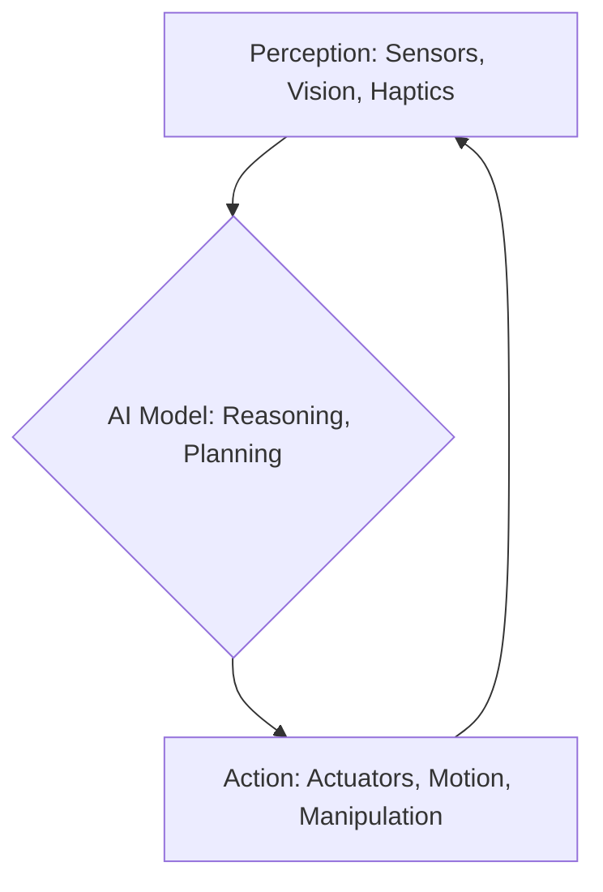

import Tabs from '@theme/Tabs';
import TabItem from '@theme/TabItem';

# Module 1: Physical AI Foundations

Welcome to "Physical AI & Humanoid Robotics," an advanced course designed to equip you with the knowledge and practical skills to develop intelligent systems that interact with the physical world. This module lays the groundwork by defining Physical AI and distinguishing it from its generative counterparts.

## What is Physical AI?

Physical AI refers to artificial intelligence systems designed to perceive, reason, and act within a physical environment. Unlike purely digital or generative AI models (such as large language models like ChatGPT) that operate primarily on data and produce text, images, or code, Physical AI focuses on embodied intelligence. It involves robots, autonomous vehicles, and intelligent machines that use sensors to understand their surroundings and actuators to perform physical tasks.

The core of Physical AI lies in the **Perception-Action Loop**:

This continuous cycle allows intelligent systems to adapt to dynamic real-world conditions, making decisions based on sensory input and executing physical responses.

## Course Overview: Hardware Paths

This course offers flexibility through three distinct hardware implementation paths. Each path provides a unique learning experience, from virtual simulation to hands-on interaction with physical robots.

<Tabs>
  <TabItem value="digital-twin" label="Digital Twin (Simulation Only)" default>
    ### Digital Twin Path: Simulation Immersion
    This path is ideal for students who want to delve deep into Physical AI concepts without requiring access to physical hardware. You will work extensively with advanced simulation environments like Gazebo and NVIDIA Isaac Sim. This allows for rapid prototyping, experimentation with complex scenarios, and exploration of high-fidelity sensor data and robot dynamics in a safe, virtual space.

    **Pros:**
    - No physical hardware required.
    - Rapid iteration and experimentation.
    - Access to advanced simulation tools.
    - Safe environment for testing risky maneuvers.

    **Cons:**
    - Lacks real-world deployment challenges (e.g., sensor noise, calibration).
  </TabItem>
  <TabItem value="edge-kit" label="Edge AI Kit (Physical Hardware)">
    ### Edge AI Kit Path: Hands-on Robotics
    For those eager to get their hands on a physical robot, the Edge AI Kit path provides an immersive experience with a dedicated robotics platform. You will deploy your AI models directly onto an embedded system (the Edge Kit), managing real-world sensor input and controlling physical actuators. This path exposes you to the practicalities of robotics, including hardware integration, power management, and real-time performance considerations.

    **Pros:**
    - Direct experience with physical robots.
    - Learn about real-world deployment and challenges.
    - Develop intuition for robot behavior.

    **Cons:**
    - Requires physical hardware (Edge AI Kit).
    - Debugging can be more complex due to hardware interaction.
    - Potential for hardware damage if not handled carefully.

    :::danger Hardware Safety Warning
    Working with physical robots requires adherence to safety protocols. Always ensure the robot is in a safe state before making adjustments. Be mindful of moving parts and power sources. **Improper handling can lead to injury or damage to the robot.**
    :::
  </TabItem>
  <TabItem value="cloud" label="Cloud Robotics (Remote Access)">
    ### Cloud Robotics Path: Remote Deployment
    The Cloud Robotics path allows you to interact with physical robots remotely, leveraging cloud infrastructure for computation and control. You will learn how to deploy and manage AI models in the cloud, sending commands to and receiving data from robots connected via the internet. This path is excellent for understanding distributed robotics, remote operation, and scaling AI solutions across multiple robotic agents.

    **Pros:**
    - Access to powerful cloud computing resources.
    - Control physical robots without direct physical access.
    - Learn about distributed systems and remote deployment.

    **Cons:**
    - Relies on internet connectivity and cloud services.
    - Latency can be a factor for real-time control.
    - Understanding the cloud infrastructure is essential.
  </TabItem>
</Tabs>

## Prerequisites

To make the most of this course, a foundational understanding of the following is recommended:

*   **Python Programming:** Proficiency in Python is crucial for developing AI algorithms and robotics applications.
*   **Linux Basics:** Familiarity with the Linux command line environment will be beneficial, especially for setting up development environments and interacting with robotic operating systems.
*   **Linear Algebra & Calculus:** A basic grasp of these mathematical concepts will aid in understanding the underlying principles of AI and robotics.

## Learning Objectives

By the end of this 13-week course, you will be able to:

*   **Design and implement** Perception-Action Loops for various robotic tasks.
*   **Utilize** ROS 2 for building robust robotic applications.
*   **Develop** and test robot control algorithms in both digital twin environments (Gazebo, Unity, Isaac Sim) and with physical hardware (Edge AI Kit).
*   **Integrate** Vision-Language-Action (VLA) models for advanced robot intelligence.
*   **Apply** control strategies for humanoid locomotion and dexterous manipulation.
*   **Deploy** AI solutions to edge devices and cloud platforms for scalable robotics.
*   **Critically analyze** ethical considerations and future challenges in Physical AI and humanoid robotics.
