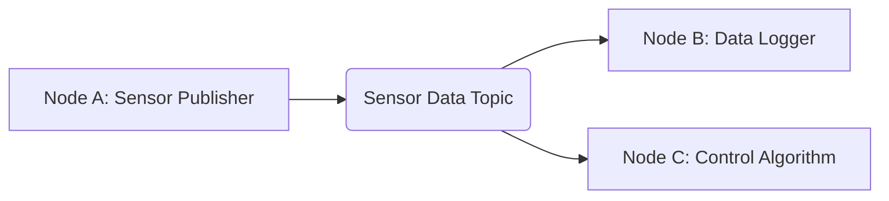

# Module 2.1: Introduction and Architecture

This chapter introduces the fundamental architecture of ROS 2, comparing it to its predecessor, ROS 1, and detailing the core components that form the ROS Graph.

## ROS 2 vs. ROS 1: A Modern Evolution

ROS (Robot Operating System) has been a cornerstone of robotics research and development for over a decade. ROS 2 represents a significant evolution, designed to address the limitations of ROS 1, particularly concerning real-time performance, multi-robot systems, and embedded platforms.

:::info Key Differences
*   **DDS (Data Distribution Service):** ROS 2 leverages DDS for inter-process communication, offering improved reliability, quality-of-service (QoS) settings, and real-time capabilities compared to ROS 1's custom TCP/IP-based communication.
*   **Distributed Architecture:** ROS 2 is inherently distributed, making it easier to manage multi-robot systems and deploy components across different machines without a central master node.
*   **Security:** ROS 2 includes built-in security features based on DDS Security, allowing for authentication, encryption, and access control.
*   **Client Libraries:** While ROS 1 primarily used `roscpp` and `rospy`, ROS 2 offers `rclcpp` (C++) and `rclpy` (Python), providing modern interfaces and better integration with language-specific features.
:::

## The ROS Graph: Core Concepts

The ROS Graph is a network of communicating processes (nodes) that perform specific tasks. Understanding this graph is essential for building modular and scalable robotic applications. The primary communication mechanisms in the ROS Graph are Nodes, Topics, and Messages.

### Nodes

:::info Definition: Node
A **Node** is an executable process that performs computation. In ROS 2, each node should be responsible for a single, modular purpose (e.g., a node for camera processing, a node for motor control, a node for path planning).
:::

### Topics

:::info Definition: Topic
A **Topic** is a named bus over which nodes exchange messages. Topics implement a publish/subscribe communication model, meaning one or more nodes can publish messages to a topic, and one or more nodes can subscribe to receive messages from that topic. This is ideal for streaming data that doesn't require a direct response.
:::

### Messages

:::info Definition: Message
A **Message** is a data structure used for communication on topics. Messages are strictly typed, allowing for robust and efficient data exchange. ROS 2 provides a rich set of standard message types, and you can also define custom message types.
:::

### The Publisher-Subscriber Relationship

The most common communication pattern in ROS 2 is the publisher-subscriber model using topics:

In this diagram:

*   **Node A** (e.g., a camera driver) publishes sensor data messages to the `Sensor Data Topic`.
*   **Node B** (e.g., a data logging application) subscribes to the `Sensor Data Topic` to save the data.
*   **Node C** (e.g., a robot control algorithm) also subscribes to the `Sensor Data Topic` to use the data for decision-making.

This decoupled architecture allows nodes to operate independently, improving modularity and reusability.