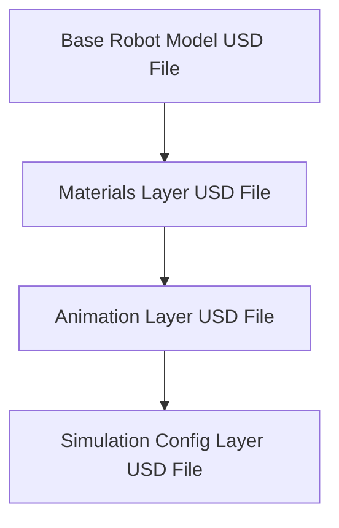

# Module 4.2: USD Fundamentals: Building Universal Scenes

Universal Scene Description (USD) is a powerful, open-source 3D scene description technology developed by Pixar Animation Studios. It's the core technology behind NVIDIA Omniverse and plays a crucial role in creating complex, collaborative, and scalable virtual worlds for robotics. This chapter will introduce you to the fundamentals of USD.

## What is USD?

:::info Definition: Universal Scene Description (USD)
**Universal Scene Description (USD)** is an extensible, hierarchical scene description format designed for content creation and interchange among different 3D applications. It allows for the robust and unambiguous description of virtually any 3D data, including geometry, materials, animations, cameras, and lights, enabling collaborative workflows and the construction of complex virtual worlds.
:::

**Key Features of USD:**

*   **Composition:** USD allows for powerful composition of scene data through a system of "layers." This means you can non-destructively overlay changes, variations, and overrides onto a base asset or scene without modifying the original data.
*   **Scalability:** Designed to handle extremely large and complex scenes with millions of primitives.
*   **Interchangeability:** Facilitates data exchange between various 3D software packages (e.g., Blender, Maya, Substance Painter, Isaac Sim) via Omniverse Connectors.
*   **Hierarchy:** Organizes scene data in a hierarchical structure (primaries, properties) similar to a file system.
*   **Versioning and Collaboration:** Supports version control and collaborative workflows, making it ideal for large teams.

## The Layering Concept

One of the most powerful concepts in USD is **layering**. Instead of flattening all scene data into a single file, USD allows you to compose a final scene from multiple, non-destructive layers. Each layer can contribute or override properties of assets defined in lower-priority layers.

Consider this simple example of how a robot model might be composed:

In this layering structure:

1.  **Base Robot Model:** Defines the robot's geometry, joints, and basic structure.
2.  **Materials Layer:** Overlays specific material properties (colors, textures) onto the base model without altering the original geometry.
3.  **Animation Layer:** Adds animation data (e.g., a walking cycle) that applies to the robot defined in the lower layers.
4.  **Simulation Config Layer:** Overrides certain properties for simulation purposes (e.g., collision meshes, physics parameters) without affecting the visual model.

This non-destructive layering enables:

*   **Variations:** Easily create different versions of an asset or scene (e.g., a red robot vs. a blue robot) by adding a small override layer.
*   **Collaboration:** Multiple artists or engineers can work on different aspects of the same asset or scene simultaneously, with their changes composited together.
*   **Reusability:** Base assets can be reused across many projects, with project-specific customizations added as separate layers.

## USD Files (.usd, .usda, .usdc, .usdz)

USD data can be stored in various file formats:

*   **.usd:** A generic extension that can represent any USD file.
*   **.usda:** ASCII format, human-readable and useful for debugging and version control.
*   **.usdc:** Crate format, a compact binary format for efficient storage and loading.
*   **.usdz:** A single-file, zero-compression archive format for easy distribution and sharing.

Understanding USD is fundamental for working effectively within NVIDIA Omniverse and leveraging its capabilities for advanced robotics simulation.