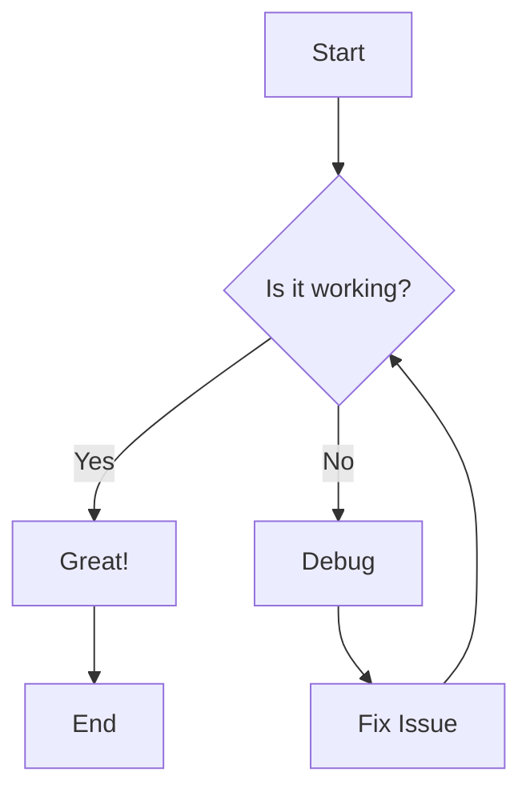
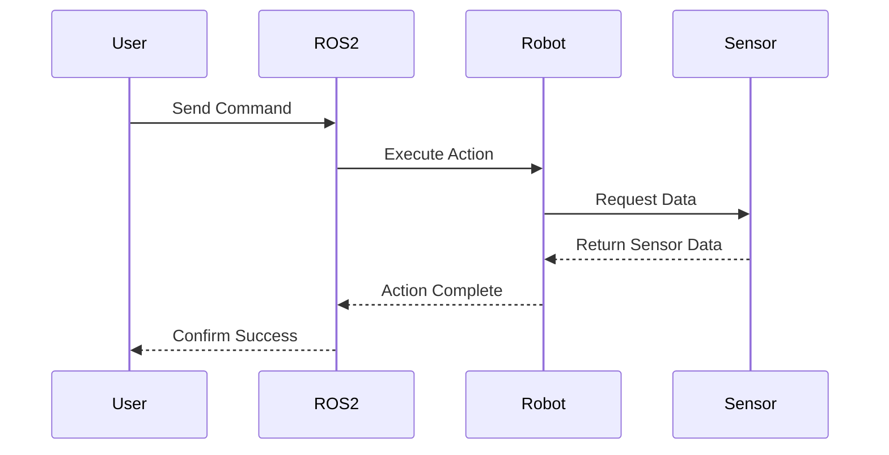
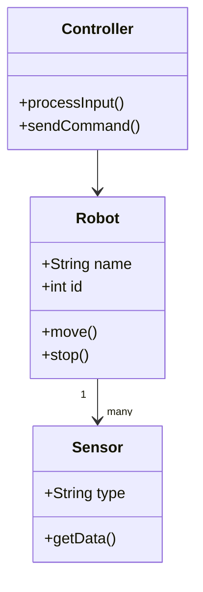
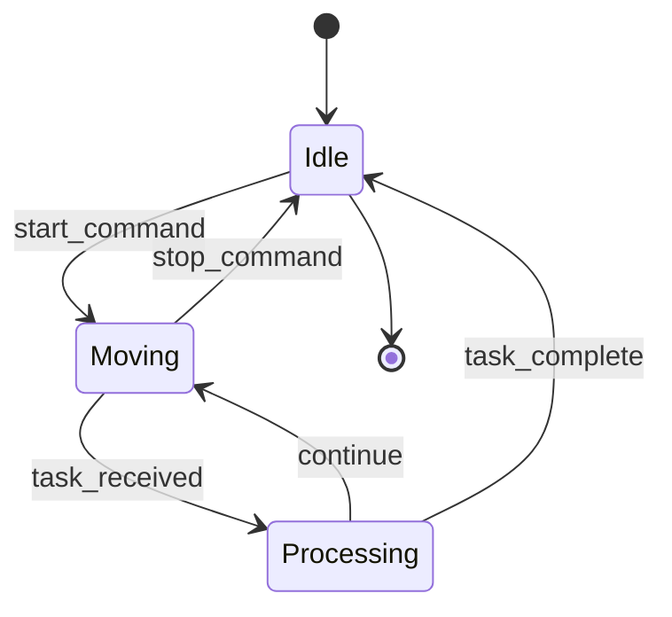
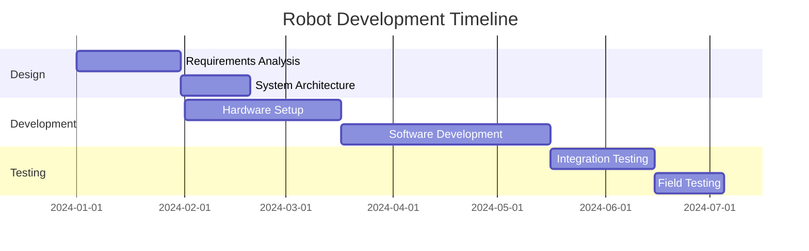
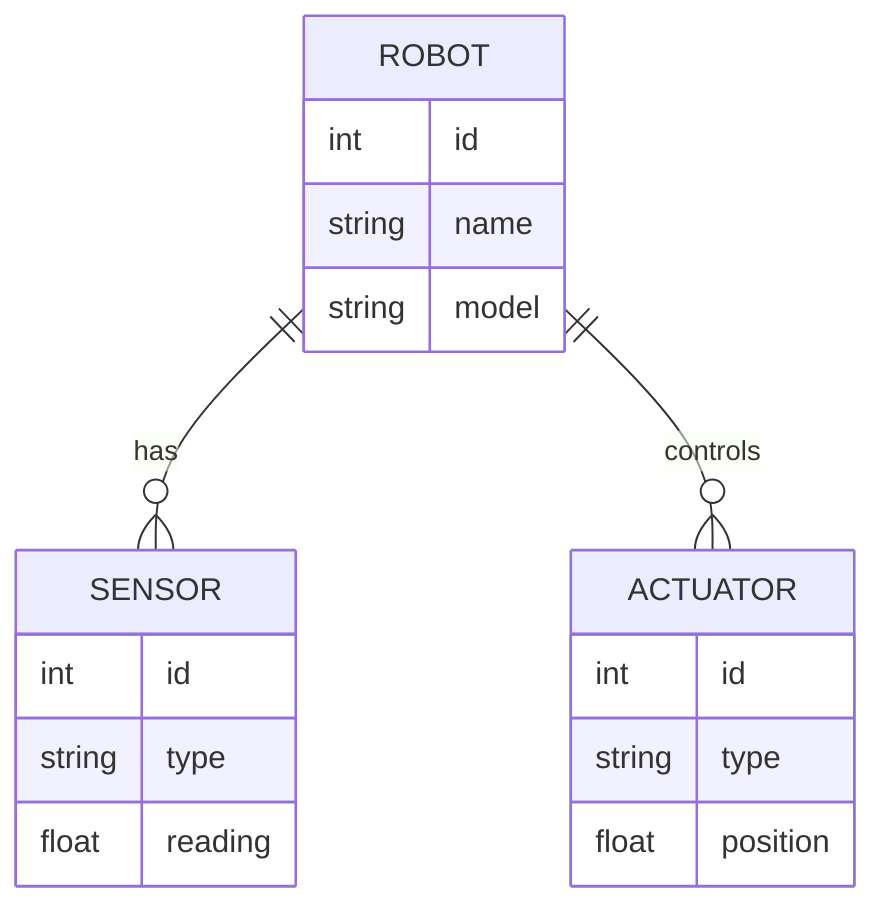
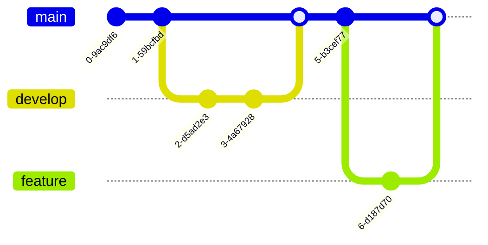
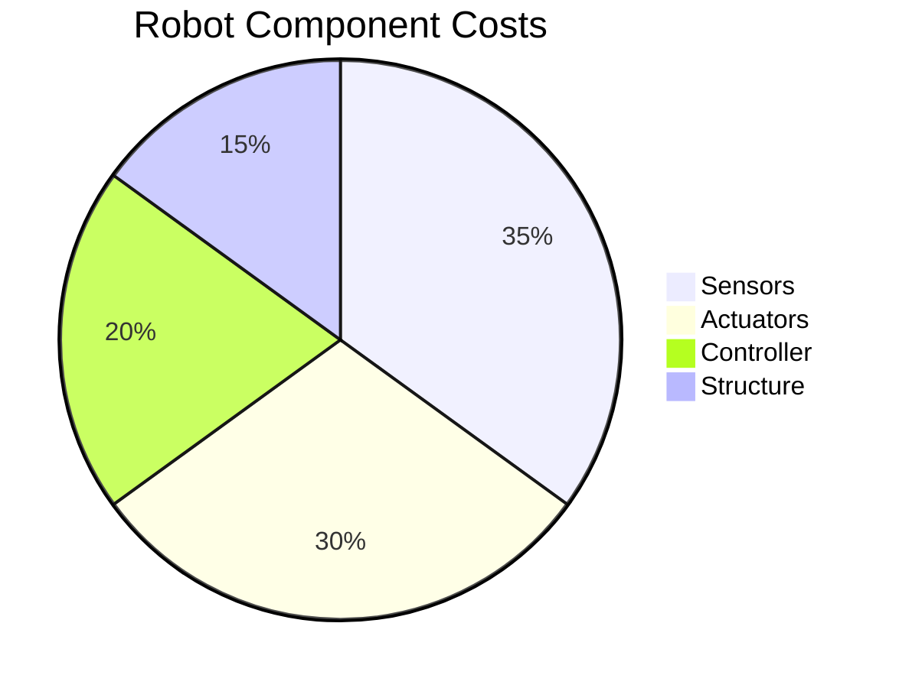
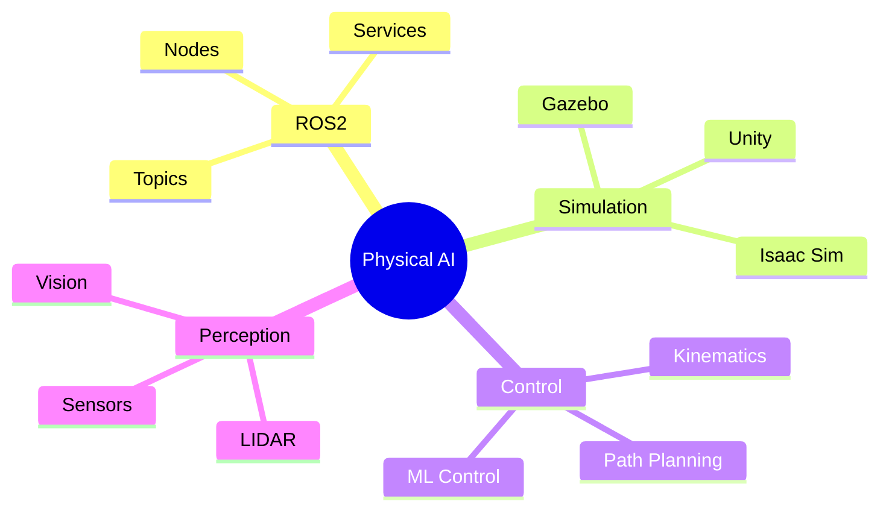
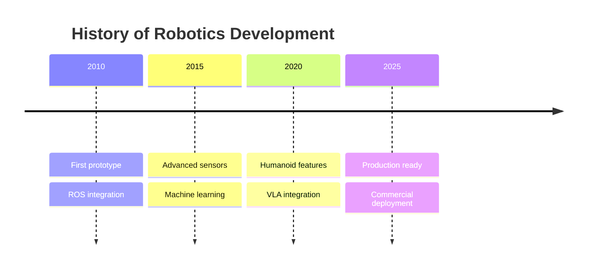

# Diagram Examples

This document demonstrates how to create various types of diagrams using Mermaid in this documentation.

## Flowchart Example

Flowcharts are useful for showing processes and decision trees:



## Sequence Diagram Example

Sequence diagrams show interactions between components over time:



## Class Diagram Example

Class diagrams illustrate object-oriented structures:



## State Diagram Example

State diagrams show different states and transitions:



## Gantt Chart Example

Gantt charts are useful for project timelines:



## Entity Relationship Diagram

ER diagrams show database or data model relationships:



## Git Graph Example

Git graphs visualize version control workflows:



## Pie Chart Example

Pie charts show proportional data:



## Mindmap Example

Mindmaps organize hierarchical information:



## Timeline Example

Timelines show chronological events:



## Usage Tips

### Syntax Highlighting

Always use the ` ```mermaid ` code fence for diagrams.

### Accessibility

Add descriptive text before diagrams to explain their purpose for screen readers and users who may have difficulty viewing diagrams.

### Performance

Keep diagrams simple and focused. Complex diagrams can be slow to render and difficult to understand.

### Responsive Design

Mermaid diagrams automatically scale to fit their container, making them mobile-friendly.

## Additional Resources

- [Mermaid Documentation](https://mermaid.js.org/)
- [Mermaid Live Editor](https://mermaid.live/) - Test your diagrams online
- [Docusaurus Mermaid Plugin](https://docusaurus.io/docs/markdown-features/diagrams)
